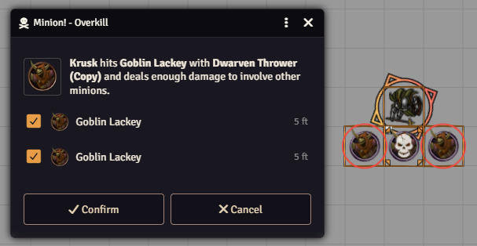
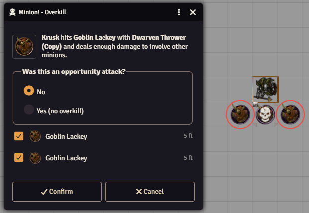
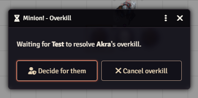
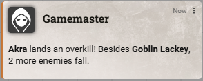
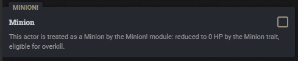
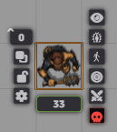
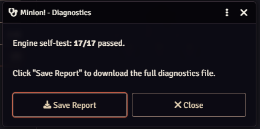

# Minion!

Minion rules for D&D 5e in Foundry VTT: the Minion trait and overkill, as described in MCDM's *Flee, Mortals!*, automated on top of Midi-QOL.



## Features

- **Minion trait.** A minion drops to 0 HP from any damage dealt by an attack or a failed saving throw. Damage from other effects (a successful save, *magic missile*, an aura) kills it only if it reaches its hit point maximum. Resistances, vulnerabilities and immunities are applied first, so a minion immune to the damage survives.
- **Overkill.** When a player character's weapon attack deals more damage than the minion's hit point maximum, the excess takes down other minions of the same kind: within reach for melee attacks, along a line one square wide up to the weapon's short range for ranged attacks.
- **Confirmation dialog.** The attacking player chooses which minions fall. The nearest ones are already selected, and a preview on the map is shown only to whoever is deciding.
- **Opportunity attacks.** Overkill can't come from an opportunity attack. When an attack happens outside the attacker's turn, or outside combat, the dialog asks.

  

- **The GM stays in control.** While a player decides, the GM can decide for them or cancel the overkill.

  

- **Chat summary** of every overkill.

  

- **Defeated minions** get the Dead status and, in combat, the defeated mark (left to Midi-QOL when it already applies them). Who killed each minion, and in which round and turn, is stored in `flags.minion-bang.killedBy` for statistics modules and macros.

## Requirements

| Package | Version |
|---|---|
| Foundry VTT | 14 |
| dnd5e | 5.3.2 to 5.3.x |
| [Midi-QOL](https://foundryvtt.com/packages/midi-qol) | 14.0.11 or later |
| [socketlib](https://foundryvtt.com/packages/socketlib) | any version for Foundry 14 |

Midi-QOL itself requires DAE and libWrapper, so Foundry will ask for those too.

The *Flee, Mortals!* module is **not** required. If it's installed, its minions are recognized automatically.

## Installation

In Foundry, open **Add-on Modules**, choose **Install Module** and paste this manifest URL:

```
https://github.com/therealsega87/minion-bang/releases/latest/download/module.json
```

## Usage

### Marking a minion

Minions from the *Flee, Mortals!* module are recognized automatically. Any other actor can be marked as a minion in two ways, which always stay in sync:

- the **Minion** checkbox in the actor sheet's **Special Traits**;

  

- the skull button in the **Token HUD** (GM only), red while the actor is a minion.

  

Unlinked tokens keep their own copy of the actor data. Check the box on the actor before placing its tokens, or use the Token HUD button on tokens already on the scene.

From a macro:

```js
await actor.setFlag("dnd5e", "minionBangMinion", true);
```

### During play

Attack minions as usual. When an attack deals damage to a minion, Minion! applies the Minion trait. If the attack was a weapon attack by a player character and the damage exceeds the minion's hit point maximum, the overkill dialog opens for the attacking player, or for the GM when that player isn't connected.

## Settings

- **Enable Debug** (per user): detailed logs in the browser console for every damage event on a minion.
- **Run Diagnostics**: runs a self-test of the rules engine and lets you download a report with versions, settings and recent activity.

  

## Assumptions and limitations

- Midi-QOL is required: Minion! reads its damage calculation.
- Attack activities must be set up as melee or ranged weapon or spell attacks (`mwak`, `rwak`, `msak`, `rsak`). Overkill only follows weapon attacks.
- Overkill is checked when the GM is viewing the scene where the attack happens. Otherwise the hit minion still dies, but no overkill is offered.
- Damage added after the attack by on-demand automations (such as CPR, GPS and similar modules) is not counted towards overkill yet.
- Scenes measured in meters have not been tested.

## Reporting a bug

Turn on **Enable Debug**, reproduce the problem, then use **Run Diagnostics** and save the report. Open an issue on [GitHub](https://github.com/therealsega87/minion-bang/issues) with the report attached and a short description of what happened.

## Credits and license

*Flee, Mortals!* is published by MCDM Productions. This module contains no content from the book: it only automates the rules, and works with minions you create or import yourself.

Released under the [MIT License](LICENSE).
